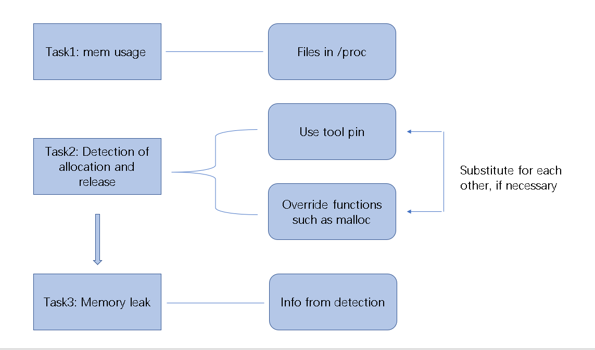
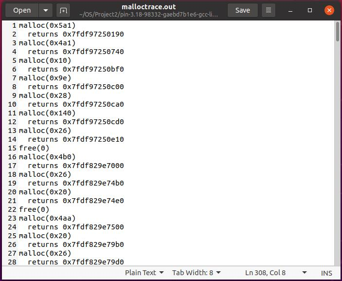

# Design Document of Process Memory Tracker

Group member: 张沐阳， 陈浩， 裴嘉鹏


## Project Background and Description

- ### Project description

  This project requires developing a tool on the Linux platform, which can display the memory usage and the possible memory leakage problem of a specific process. The general requirement including aspects :

  - Statistics of processes and threads in operating system should be performed in real time.
  - Keep a real time Detection of certain process's memory leakage problem, such as its memory, file handle. The result should be displayed in real time or output to a file.

  Furthermore, the tool shouldn't cause too much effect on the system's performance, and it orients C/C++ programs.

- ### Background

  ​    Linux system needs to run at an optimal level, making the display of memory usage relevant information and monitoring memory statistics vital. Moreover, It is often essential to check memory usage and memory used per process so that resources do not fall short, since some unexpected behavior may at times be caused by system resource limitations. It may happen that the system will become very slow or even go down when there is a traffic spike. 

     A memory leak is any portion of an application which uses memory without eventually freeing it. An application that continually uses more memory without freeing any will eventually exhaust the pool of memory. When this happens, the application is likely to crash the next time it attempts to use more memory. For instance, in C/C++, a memory leak usually happens when a user invokes *new* but forgot to invoke the corresponding *delete*. In other environments, such as Java, the operating system allocates and deallocates memory automatically. While programmers are error prone to allocate and deallocate memory specifically, they control the computer's resources.
  
  #### Related Work
  
  - ##### Valgrind
  
    Valgrind is an instrumentation framework for building dynamic analysis tools. There are Valgrind tools that can automatically detect many memory management and threading bugs, and profile the programs in detail. One of Valgrind's tools is Memcheck, which is a memory error detector. It is able to detect memory leaks, using undefined values, incorrect freeing of heap memory, e.t.c.
  
  - ##### Dmalloc
  
    The debug memory allocation or dmalloc library has been designed as a drop in replacement for the system's malloc, realloc, calloc, free, and other memory management routines while providing powerful debugging facilities configurable at runtime. If any of the above debugging features detect an error, the library will try to recover.
  
  - ##### libleak
  
    This a lighter-weight tool compared to the two tools mentioned above. libleak detects memory leaks by hooking memory functions (e.g., malloc) by LD_PRELOAD. There is no need to modify or re-compile the target program, and the user can enable/disable the detection during target running. Moreover, there is less impact on performance compared with Valgrind.
  
    


## Implementation

### General Technical Route




### Task1: Real time statistics system process and thread memory usage：

use `/proc` file to check the memory use of process and thread and we can use ` std::ifstream` in c++ to read this file

##### 1. Get all processes' pid

​	use `std::filesystem` to check folders whose file name is a number in `/proc` , these files' name are all                 processes of the system

​	

##### 2. Get memory usage of a certain process

​	read `/proc/pid/status` file to check information of memory usage

​	

##### 3. Get threads of a process

​	check folders in `/proc/pid/task` , folders are corresponding threads of the  process

​	

##### 4. Get memory usage of a thread

​	read `proc/pid/task/tid/status` file to check the memory usage of a thread

##### 5. Show the information in realtime

​    repeat step 1 - step 4, every 5 milliseconds then show the statistic result, in this way, it can achieve realtime statistic.


#### Probable merits and innovations:

- Comprehensive and detailed information of processes including stack size and data segment size e.t.c
- Multiple threads' information.


### Task2: Detection of the memory allocation and release in a process：

We figured out two approaches. They can be each other complements.

- #### Override memory management functions such as *malloc* without changing the original code

  In the code ( written in cpp ) of our tool:

  1. **Override *malloc*, *calloc*, e.t.c.**

     Besides allocating some space, the overidden functions also output the memory information to a log for storage. Information like allocated size and the pointer should be stored. *new* operator also invokes *malloc*.

  2. **Import the real function call**

     For instance, using the system *malloc* call to allocate the space. Use the following lines to retrieve the according system functions. The function *dlsym* takes a "handle" of a dynamic library and the null-terminated symbol name, returning the address where that symbol is loaded into memory. 

     ```C++
     real_malloc = dlsym(RTLD_NEXT, "malloc");
     
     real_realloc = dlsym(RTLD_NEXT, "realloc");
     	
     real_calloc = dlsym(RTLD_NEXT, "calloc");
     
     real_free = dlsym(RTLD_NEXT, "free");
     
     /* And also some file handle related functions, omitted here. */
     
     ```

  3. **Initialize overriden functions in __ attribute __ ((constructor))**

     *__ attribute __ ((constructor))* runs when a shared library is loaded, typically during program startup.

  4. **Provide temporary and simple memory allocation buffer**

     Segmentation fault can happen sometimes, which is due to the fact that *dlsym* may invoke the allocation functions, causing a recursion to the end of the stack. The solution is to provide a simple static allocator that takes care of allocations before *dlsym* returns the *malloc* function pointer.

     ```C++
     /* for example */
     static void * tmp_malloc(size_t size);
     static void *tmp_calloc(size_t n, size_t size);
     static bool tmp_free(void *p);
     static void *tmp_realloc(void *oldp, size_t size);
     /* And also some file handle related functions, omitted here. */
     ```

  5. **Use LD_PRELOAD**

     Build our library as a shared object. Set to the path of a shared object, that file will be loaded before any other library (including the C runtime).

     ```shell
     $ LD_PRELOAD=/path/to/my/library.so ./code
     ```

     

- #### **Pin** 

  1. ##### A just-in-time code injection tool.

     ​	Pin is a tool for the instrumentation of programs. Pin allows a tool to insert arbitrary code (written in C or C++) in arbitrary places in the executable. The code is added dynamically while the executable is running. This also makes it possible to attach Pin to an already running process.

     ​	Pin provides a rich API that abstracts away the underlying instruction set idiosyncracies and allows context information to be passed to the injected code as parameters.

  2. ##### Detect heap memory allocation and release in a process.

     ​	By using pin and its corresponding API, we are able to insert code segments in every places in the executable. Thus, it's possible to detect memory allocation instructions including `malloc()`, `free()`, `new()` , `delete()` and **file handle** related instrcutions in the executable. Once detecting these instructions, we save these instructions into a .log file. In this way, we are able to detect memory allocation and release in a process. 

     

  3. ##### Monitor the allocation and release of the file handle in a specific process.

     ​	Similar to above section, we are able to detect memory reference trace information of a certain process.  We are able to see a process's current opened files, file's status(Read or Write) and other information. 
  
     

#### Probable merits and innovations:

- Comprehensive information of a certain process is output to a log in real time.
- A reasonable and appropriate way to display these information will be provided to user, probably neat data or a chart.


### Task3: Check whether there is a memory leak in a process.

- #### **Pin** 
   There're mainly two features.
     1. ##### End of process check. 
   
   - Firstly, keep the record of a process's memory allocation and release instructions during executing. Secondly, instrument codes using pin at the end of the executable. These codes will be utilized for checking memory leak. Thirdly, before the exit of current process, we check whether there exists un-freed block memory, which indicates a memory leak. Finally, we retrieve the suspicious instructions from the instruction record we have kept, and output these instructions. 
   
     2. ##### Run-time check.(Maybe too difficult.Optional.)
   
   - We will calculate the number of memory allocation instructions and free instructions. If the number of memory allocation instructions continue to grow in a rapid speed and overwhelms that of memory release instructions, memory leak may happen. We can monitor this situation and output suspicious instructions.
- #### By overriding memory management functions

  - When the system call `malloc`, we will malloc bigger space than requested

  - In this extra part, we can use a struct `malloc_info` to store the information of this memory e.g which line of code call malloc.

  - ```c++
    /* This is just a raw example to illustrate the idea */
    struct malloc_info{
        malloc_info* pre;
        malloc_info* next;
        int line;
    }```

    
- We will maintain a `list` of `malloc_info` , when system call `malloc`, we can add `malloc_info` into the `list`, when the system call `free`, we can remove it from the `list`  (new and delete are the same )
  
  -  At the end of the code, we will check whether this `list` is empty or not. If it is empty, there is no memory leak. If it is not empty, we can find the line of `malloc` which missed the necessary `free`. 
  
  

#### Probable merits and innovations:

- The memory leak will be located as precise as possible.

- If we have sufficient time, we would like to accomplish some of the followings:

  - Real time memory leak detection.
  - Detection of dangling pointers which are probably caused by the mis-behaved memory free operations. 

  


## Expected Goals

1. **Keep real-time statistics on the system process and its thread memory usage**.

   - Coding should be used to realize the statistics of memory usage information, and the memory statistics data are sorted and displayed in real time.

2. **Detection of the memory allocation and release in a process.**

   - Coding is employed to detect memory allocation and release in a specific process.
   - Coding is employed to monitor the allocation and release of the file handle in a specific process.

3. **Check whether there is a memory leak in a process.**

   - Record the process memory allocation and release, and confirm whether there is a leakage; If there is, point out the suspicious code.

   


## Division of Labor

​	The three expected goals will be solved serially. For each goal, we will generally follow the implementation route. If faced with obstacles, we'd like to attempt other approaches and figure out the solution together.

- Task1: We three together solve this.
- Task2: 张沐阳 use method 1 first. 陈浩, 裴嘉鹏 use method 2. A final method will be chosen together and may be a mixed one of the two.
- Task3: We three together solve this.
