## Result Analysis

- **Task1**

  In Part 1, we have complete all functions mentioned in design document. 

  goals implemented: 

  - we can show the memory usage statistic in real time and sort them by memory size, 
  - for multiple threads we can find there tid. 
  - also, we use gui table to show the result.   

  ​	here is a screenshot of UI:

  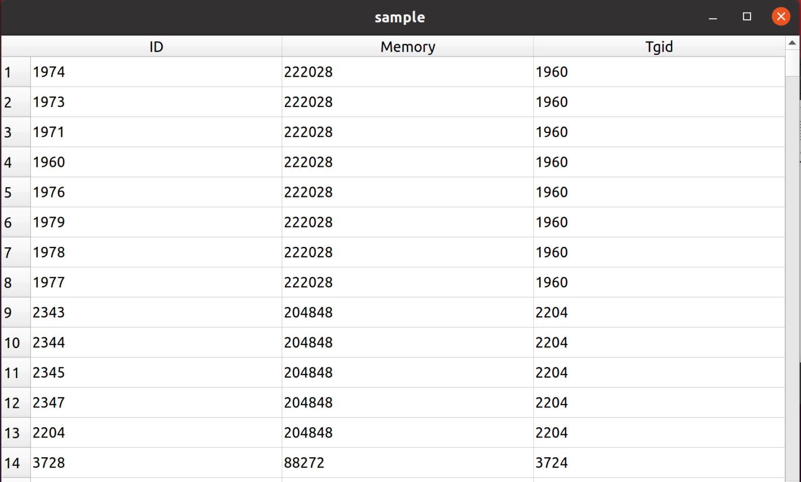

  in this graph, each thread's information(id, memory, tid) are shown in this table, and table is updated every second. 

  In this part, we still use c++ to implement gui instead of using python or other language which is easier to draw a graph, because our whole project is written by c/c++, in this way, it is more compatible to the whole project.

- **Task2**

  For this part, we choose to use DLL hook instead of modifying or adding header files to the user's source code, so that the tool does not need the user's code, only needs executable files. When their code is very complex, it may be time-consuming to modify it properly, or even users do not want to modify their code. Therefore, our solution is easier for users to use.

  

  how to use:

  1. First you need to compile your program e.g `gcc -o malloc ./malloc.c -g -rdynamic` 

     (`-g -rdynamic` is for using `backtrace` )

  2. build your DLL: `gcc -o prehook.so -fPIC -shared premalloc.c -ldl` 

  3. then you can execute your program `LD_PRELOAD=./prehook.so ./malloc`  (thus e.g when your program call `malloc` the DLL will replace it using the `malloc` function in `./prehook.so` )

  

  Goals implemented:

  - Monitoring memory allocation
  - File handle info

  Monitoring memory will be showed in Task 3 result, since this part is similar and related to Task3.

  As for file handle info, we first test in a small program.

  ```c
  int main()
  {
      FILE* file = fopen("./test.txt", "r");
      FILE* file1 = fopen("./zmy.c", "r");
      FILE* file2 = fopen("./libadd.so", "r");
      int b = fgetc(file);
      fclose(file);
      fclose(file2);
      return 0;
  }
  ```

  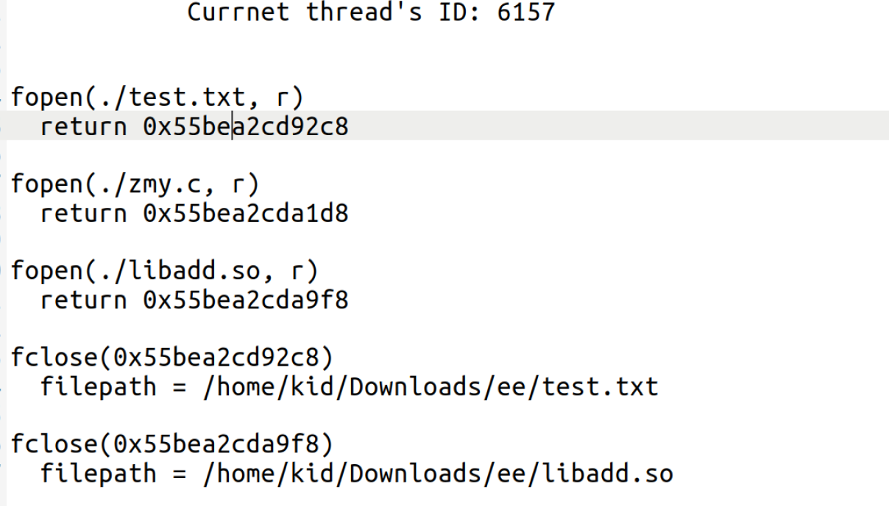

  

  in this test, we use fopen() and fclose() to operate files (e.g."./test.txt"), we can see the these two operations are recorded in file "handle_info.log" with return file handler in fopen and file name in fclose.

  

  Our tool is able to record complicated system program ssh's file handle.

  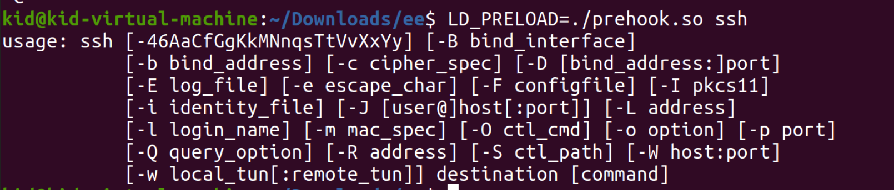

  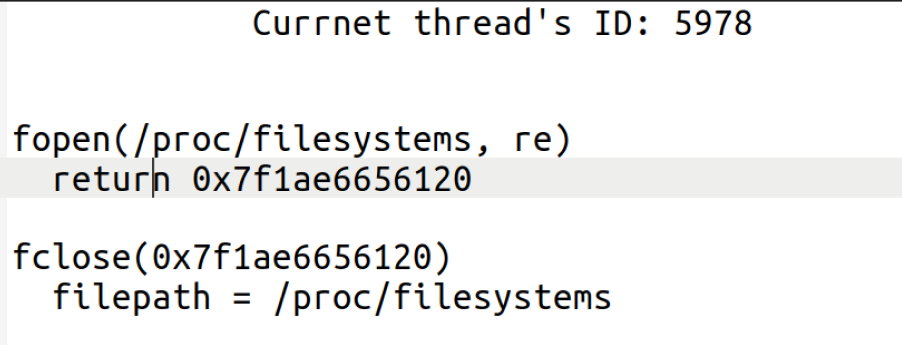

  ssh only open 1 file, as we can see.

  

  Goals changed:

  - We discarded pin.

    We try to use pin at first, because we think we only need to insert some codes after trace, we can record the message of `malloc` and `free`, but after trying for several days, we find trace instrumental is not appropriate for this problem and instruction instrumental will largely decrease the performance, so we decided to use DLL hook at last.

- **Task3**

  - Expected goals that we have achieved:

    1. Record the process memory allocation and release

    2. Confirm whether there is a leakage

    3. Point out probable leakage part

  - Effects:

    A sample code called *test* to demonstrate the effects:

    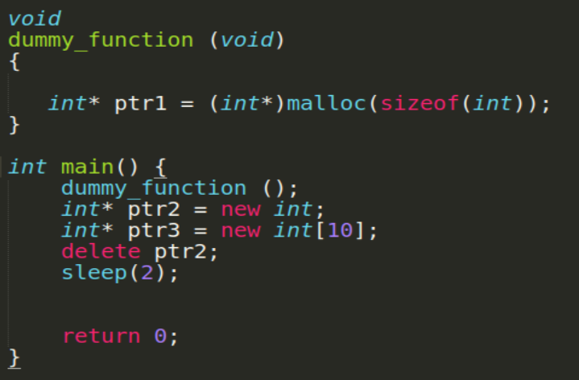

    Some Observations: Firstly, there are two memory leakage: ptr1 in dummy function and ptr3 in main. Secondly, we see that ptr1 is declared in a function, and this code includes *new* & *malloc*. Thirdly, this sample code sleeps for 2 seconds. 

    Thus, we want to use this code snippet to illustrate out tools' usage and effects.

    Our tool is written in a file called *Final_1_1.c*, and the sample test code is *test.cpp*. The usage is shown in the picture below.

    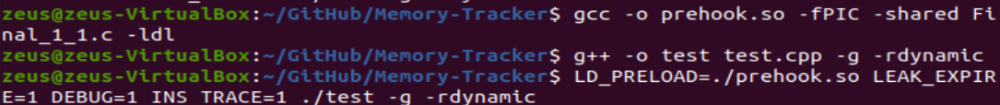

    The user needs to build our cpp into a *.so* file and compile their program. Then they uses the third command in the image above to run our tool and their program. The meanings of *LEAK_EXPIRE*, *DEBUG*, *INS_TRACE* are discussed later.

    After these commands, the memory information is written into a log for user to check. We have discussed with the Professor and consider of stack memory has little to do with memory leakage, our tool only records heap memory management.

    The memory log is shown below:

    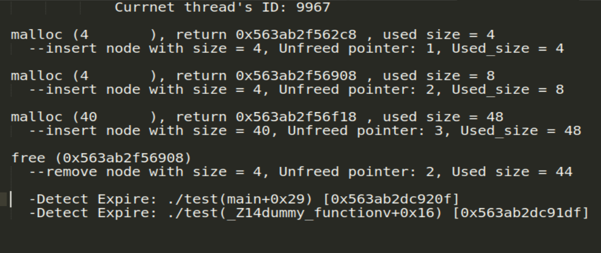

    1. First line is the thread id of the *test* program.

    2. **malloc** indicates the tested program invokes a **malloc** or a **new**( **new** invokes **malloc** implicitly). Number in the parenthesis is the **malloc** size. Return is the address of the pointer. Used size is the total used size in the heap. 

    3. As for **free**, the line illustrates that a **free** or a **delete** (**delete** implicitly invokes **free**) is invoked. Number in the parenthesis is the freed pointer.

    4. Our memory management uses **list** data structure to store information. *DEBUG* variable mentioned above gives user the right to print **list** information. Therefore, in the picture, a node is inserted when **malloc** is invoked, and the node is removed when **free** is invoked. Unfreed pointer indicates the number of nodes in the **list**.

    5. Our tool lets user to choose a memory expire time span, which means our tool prints leakage info after the set time.

       In this example, the test program runs for more than two seconds. *LEAK_EXPIRE* sets the time to be 1 millisecond. So the leakage info are printed after 1 millisecond triggered by every **free**, in **Detect Expire**.  This mechanism is significant. For instance, if a user runs a server, and the connections are closed after 300 seconds. The user sets *LEAK_EXPIRE* to be 300000 milliseconds, and then he can detects whether the connection is successfully closed. 

    6. There are 2 possible leakage in *Detect Expire*. They are at *test* and the functions, addresses are shown in the parenthesis. This result **matches** the *test* scenario.

  

  ​		Another test case:

  ​		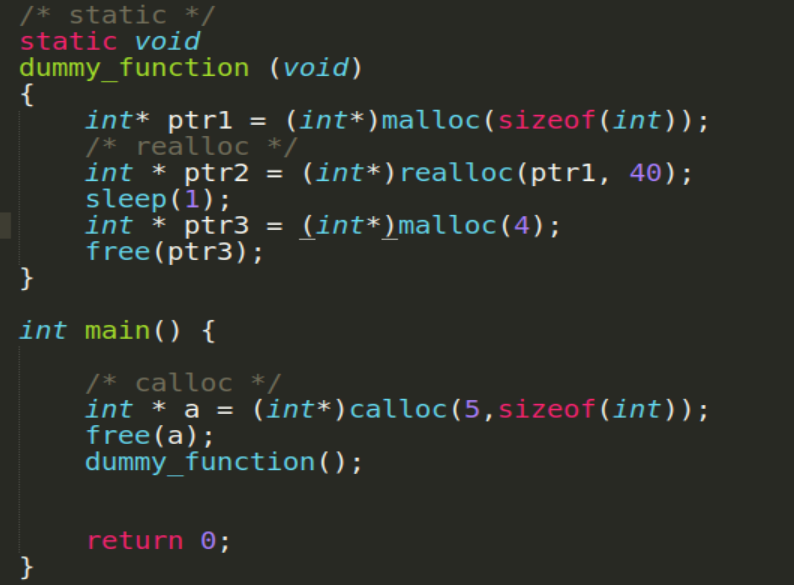

  ​		This example is different from the last one. First, the dummy function is static function. Second, the example            			 		demonstrates usage of **calloc** and **realloc**.

  ​		The result memory log is shown below:

  ​        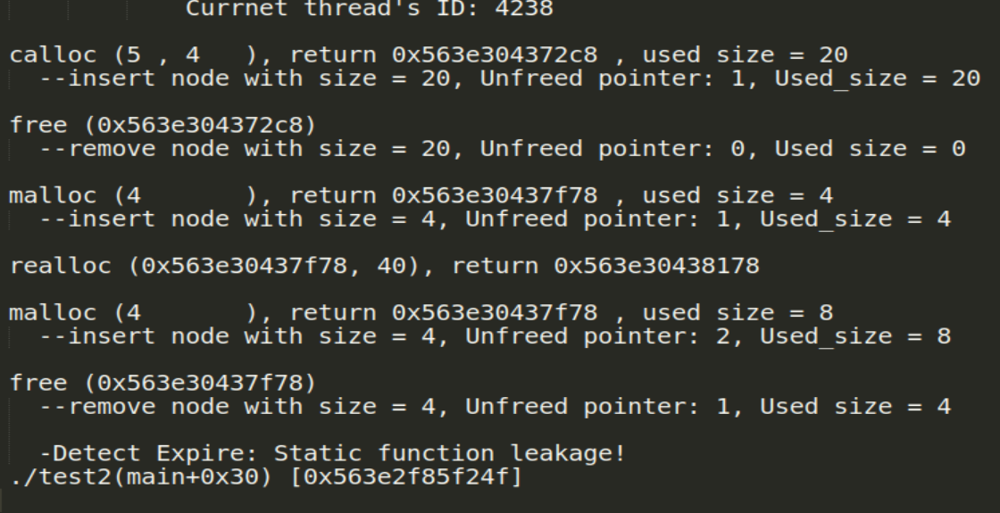

  1. The user is able to see the **calloc** and **realloc** information. **calloc** records the *nitems* (in this example is 5), *size*(in this example is 4). **realloc** records the old address, and new pointer address, new allocated size.
  2. Our tool cannot identify static function name. Details will be explained in *Implementation* sector.  In this example, *ptr2* causes a memory leak. In picture's **Detect Expire**, it shows the major call-stack, which indicates that the main function invokes a static function, and that static function has a memory leak.

  

  Next, we test our tool by running some complicated system program. 

  Here's ssh: .

  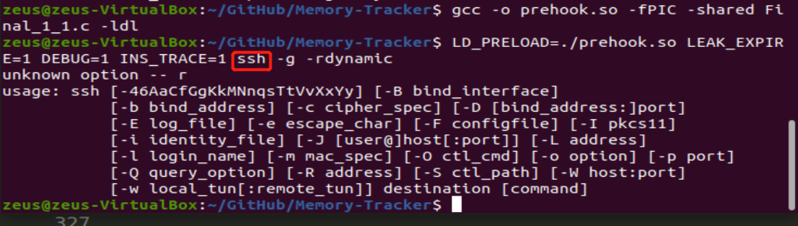

  Here are some glimpse of the output message: We successfully record all the memory allocation and leakage information!

  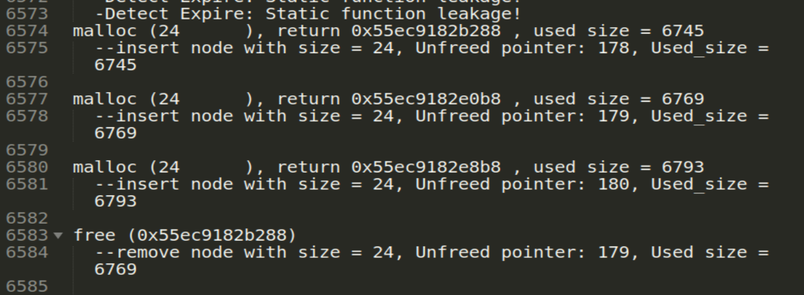

  ssh is complicated, and our tool outputs a  total 1995313 lines:

  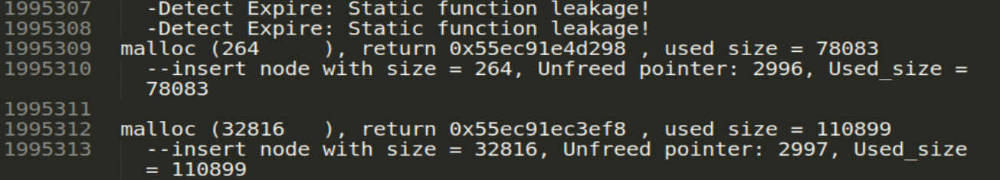

  1.  Our tool is able to manage a surprisingly sophisticated program.
  2.  ssh has some function leakage, and we find this is true by searching on Google.
  3.  ssh invokes huge amount of realloc, calloc, which testifies our tool works smoothly under all kinds of circumstances.

  

  Here is /bin/ls:

  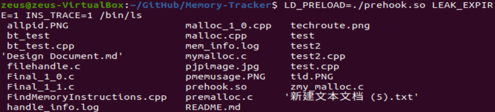

  We successfully record the memory information of /bin/ls, which includes calloc, realloc, e.t.c.

  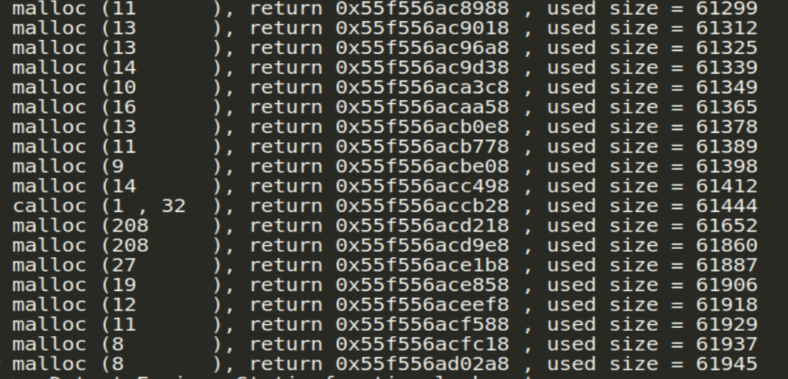

  

  - Goals haven't been achieved:
    
    1. In Real time
    
       It is not practical to monitor memory in real time. First, programs like ssh is too complicated to output memory information in real time. Second, real time requires too much CPU energy and too hard to code. Therefore, we instead use *LEAK_EXPIRE*. Users sets a time limit, and **malloc** which exceeds the limit will be treated as probable leakage.
    
    2. Check at the end of the code
    
       Having discussed with the teacher, we found that it is nearly impossible to let the program signal before it dies. So, instead, we let the memory detection triggered by **free**. It is reasonable to judge when **free** is invoked.
    
    3. Pin
    
       In design document, we also proposed this method. In practice, we used the one discussed above and discarded Pin.


## Implementation

- **Task1**

  1. first you need to download qt using command `sudo apt-get install qt5-default`

  2. after download you build the project `qmake -project` then you need to add `QT += gui widgets` to  file `sample.pro`

     ```c
     INCLUDEPATH += 
     QT += gui widgets
     ```

  3. use command `qmake sample.pro` to make the .pro file platform specific. then change g++ version to c++17

     ```c
     CXXFLAGS += -std=c++17
     ```

  4. use `make` to compile makefile

  5. you can run it just by `./sample`

  the implementation for this part, we will review the implementation mentioned in design document

  1. read `/proc` file to get all process's id to monitor and use `filesystem::directory_iterator()` to iterate directories whose name is number, which means they are processes in this file.

  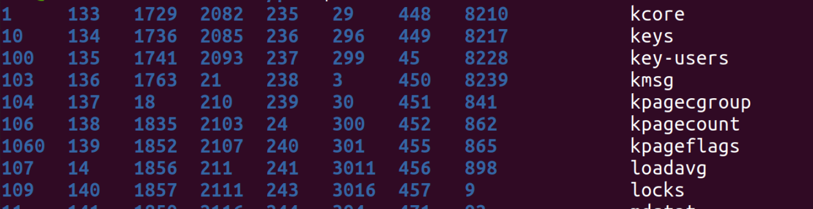

  2. read `/proc/filename/status` we can get memory info and Tgid info, and extract number from these strings

  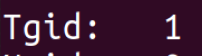

  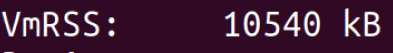

  3. in `/proc/filename/task` we can get threads of the process and we can use the same method to get information of the thread just the same as mentioned

  

  4. notice: for some process, there is no `VmRSS` item in status file. thus we need to read `/proc/id/statm` file and use the second value to get memory information

  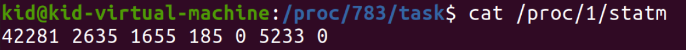

  5. For UI part, we use qt to implement. we create `qTableView` and `QStandardItemModel` to show the result and use `Qtimer` to update result every 1 second to achieve real time showing.

  ```c++
  connect(&m_timer, SIGNAL(timeout()), this, SLOT(onTimeout()));
  m_timer.start(1000);
  ```


- **Task2**

  This part's skeleton is generally the same as **Design Document**. Hence, the **Design Document** idea is briefly *rehashed* here:

  1.

  > #### Override memory management functions such as *malloc* without changing the original code
  >
  > - **Override *malloc*, *calloc*, e.t.c.**
  >
  >   Besides allocating some space, the overidden functions also output the memory information to a log for storage. Information like allocated size and the pointer should be stored. *new* operator also invokes *malloc*.

  Furthermore, in practice, we create a **list** structure. The program creates a **malloc_list_node** when **malloc** is called. It stores *create_time* and *callstack* information for task 3 to use. 

  Other basic information outputs to log immediately.

  - For **malloc**, we output its *return address* and *size*. 
  - For **free**, we output the *freed pointer*.
  -  For **calloc**, we output *item number* and *item size*. 
  - For **realloc**, we output *old address*, *new address*, *new size*. 
  - For **fopen**, we output *pathname* and *mode*
  - For **fclose**, we output the *closed pathname*. In addition, the implementation of **fclose** is tricky( because the pathname info is covert ) and is discussed in later part.

  ```C
  struct malloc_list_node {
      struct malloc_list_node* prev;
      struct malloc_list_node* next;
      clock_t create_time;
      char* info_str;
      size_t size;
  };
  ```

  

  2.

  > **Provide temporary and simple memory allocation buffer**
  >
  > Segmentation fault can happen sometimes, which is due to the fact that *dlsym* may invoke the allocation functions, causing a recursion to the end of the stack. The solution is to provide a simple static allocator that takes care of allocations before *dlsym* returns the *malloc* function pointer.
  >
  > 
  >
  > ```c
  > /* for example */
  > static void * tmp_malloc(size_t size);
  > static void *tmp_calloc(size_t n, size_t size);
  > static bool tmp_free(void *p);
  > static void *tmp_realloc(void *oldp, size_t size);
  > /* And also some file handle related functions, omitted here. */
  > ```
  >
  > 

  In  practice, we indeed have been faced with some *segmentation fault* without *temporary memory*. This is owing to the fact that **malloc** is called before the **malloc** is hooked or **dlsym** invokes allocation functions. Thus, this problem is solved neatly by some temporary allocators. Mechanism is as follows:

  Firstly, if real allocation functions is not hooked, then static allocator if called first. Take **malloc** as example:

  ```c
  void * malloc(size_t size) {
      if (real_malloc == NULL) {  // if real_malloc is null, use tmp_malloc
          return tmp_malloc(size);
      }
      //...
  ```

  Secondly, temporary memory is an array. A pointer is used to show the start address of the free space of the memory. Take tmp_malloc as an example:

  ```c
  static int cache[1024 * 1024]; 
  static int *cache_ptr = cache;
  static void *tmp_malloc(size_t size)
  {
      void *p = cache_ptr;  
      cache_ptr += size;    
      return p;
  }
  
  ```

  The rest allocation functions are similar to the one above.

  

  3.

  Import the real function call

  For instance, if we want to get the original malloc function implemented by system, we can use dlsym function.

  > The function dlsym takes a "handle" of a dynamic library and the null-terminated symbol name, returning the address where that symbol is loaded into memory.
  >
  > ```c
  > real_malloc = dlsym(RTLD_NEXT, "malloc");
  > real_realloc = dlsym(RTLD_NEXT, "realloc");
  > real_calloc = dlsym(RTLD_NEXT, "calloc");
  > real_free = dlsym(RTLD_NEXT, "free");
  > ```

  

  4.

  overriden functions in __ attribute __ ((constructor))

  calledFirst() function in below runs when a shared library is loaded, typically during program startup.

  ```c
  static void __attribute__((constructor)) calledFirst();
  static void calledFirst()
  { ... }
  ```

  But we find sometimes calledFirst function is not the first to run and we also need to handle this situation. 

  

  Besides the design document, there are some more techniques to be discussed:

  1. `fopen`&`fclose`

     we can overwrite `fopen` and `fclose` the same as above using `dlsym`. when we call `real_fopen` and, it will return a file pointer and we can return this pointer to user, when we call `real_fclose` system will clear file handler besides we will record this message to a file.

     Because struct `FILE`  does not have filename member, so we use `/proc/seld/fd/fno` file and `readlink` command to get filename corresponding to fno.

     ```c
     fno = fileno(file);
     sprintf(proclnk, "/proc/self/fd/%d", fno);
     r = readlink(proclnk, filename, MAXSIZE);
     ```

     We also find when we call `dlsym(RTLD_NEXT, "fopen")` and `dlsym(RTLD_NEXT, "fclose")` twice, there will be segment fault problem. thus, we need to use a flag to guarantee that this command will not be call twice.

  

  

  

- **Task3**

1. **Allocate extra memory to store information**

   In task2 implementation, we have introduced that our tool manages to output all related memory information to a log. As for task3, we believe it is non-elegant and low-performance to simply read the log and compare the strings.  Therefore, aiming to detect memory leak, we *allocate extra memory* when calling malloc. To illustrate, we maintain a list. List node is stored at the extra memory. Every time the user program calls a malloc, a new node is created and added to the list. Every time the user program calls a free, the freed node is removed from the list. In this way, the nodes remained in the list are suspicious memory leakage nodes.

   Here, we detail the allocation strategy:

   We implementation our memory-trace feature by overriding following library calls:

   ```c
   malloc(size_t size){};
   calloc(size_t num, size_t size){};
   realloc(void* ptr, size_t size)P{};
   free(void* ptr){};
   ```

   #### malloc

   

   - As above graph illustrates, if program calls ` malloc(size) ` , we actually call `real_malloc(size + HEAD_SIZE)` . The additional bottom memory space is used to store `malloc_list_node` in order to trace memory leak.
   - Writes information to `mem_log.out`.

   #### calloc

   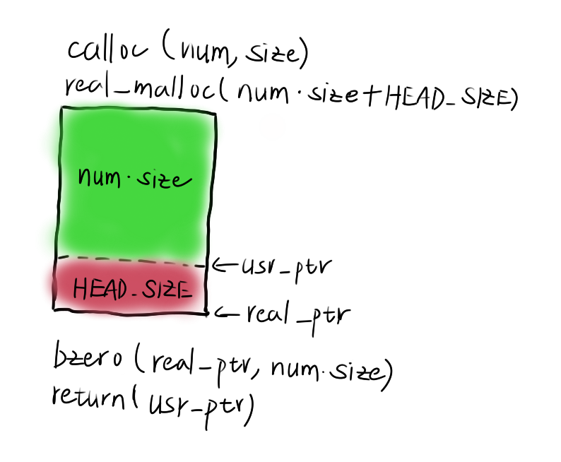

   - `calloc(num, size)` returns an memory space of size `num * size` which is initialized to 0. So it's very similar to malloc, the only difference is initialization. So what we do is simply use `real_malloc(num * size)` and set returned memory space to 0.
   - Writes information to `mem_log.out`.

   #### realloc

   Override `realloc(void* ptr, size_t size)` is more complicated, since the behavior of the library call depends on variety of factors including parameters and heap status. Let's discuss these cases one by one.

   - `ptr == NULL`

     If ptr is NULL, its effect is the same as malloc(), that is, it allocates `size` bytes of memory space. In this case, it calls `malloc(size)`.

   - `size == 0`

     If the value of size is 0, then the memory space pointed to by ptr will be released, but since no new memory space is opened, a null pointer will be returned, which is similar to calling free(). In this case, it calls `free(ptr)`.

   - `ptr != NULL && size != 0`

     Executes following code segments:

     ```c
     struct malloc_list_node* old_ptr = (struct malloc_list_node*)(char*)ptr - HEAD_SIZE;
     struct malloc_list_node* prev = old_ptr->prev;
     struct malloc_list_node* next = old_ptr->next;
     
     struct malloc_list_node* new_ptr = (struct malloc_list_node*)real_realloc(old_ptr, size + HEAD_SIZE);
     ```

     - `new_ptr != old_ptr`

       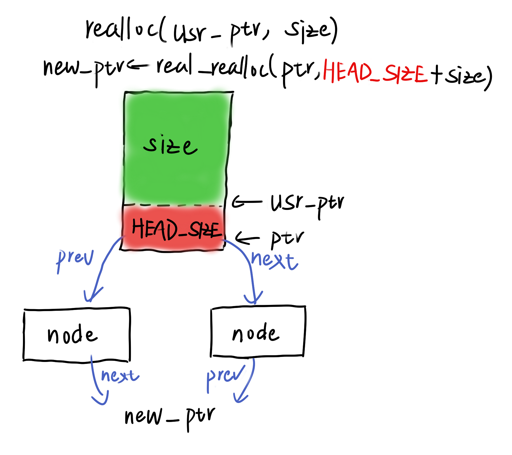

       The values in the new memory space remains the same, but the address pointer is changed. So we need to modify pointers which values are `old_ptr`, to `new_ptr`.

     - `new_ptr == old_ptr`

       There's nothing we need to do, since values in bottom `HEAD_SIZE` space remain the same. Though values in upper `size` space may diminish or augment with 0s, our linked size maintains the same.

   - Writes information to `mem_log.out`.

   #### free

   - Get `real_ptr` through substracting `HEAD_SIZE` from `usr_ptr`.

   - Update linked list, and check whether node's live time exceeds `EXPIRE_TIME`. If it does, writes information to `mem_log.out`.

     

   - Free memory space by calling `real_free(real_ptr)`.

2. **backtrace.h**

   In order to find the probable memory leak code, our tool prints the *callstack* of suspicious part. In fact, C provides a macro for user to find line number. However, our tool aimed at executable file, which makes it unable to insert the macro. Therefore, it is the best to print the *callstack*. We use "backtrace.h" to find callstack. Core code is as follows:

   ```C
   int size;
   char **strings;
   void *array[10];`
   size = backtrace (array, 10);  /* (1) */
   strings = backtrace_symbols (array, size); /* (2) */
   ```

   Line (1) finds how many frames in a callstack.

   Line (2) returns a string array containing the information of each frame. Furthermore, **backtrace** also calls **malloc**. Thus, we add some conditions to avoid recursion.

   After re-organizing and storing, we print the call-stack information as last sector shows.

3. **Trigger by free**

   As mentioned before, the messages printing is triggered by free. If the *INS_TRACE* is true, free will check whether each **malloc** in the list is time up. If it has exceeded time limit, then the program will invoke **backtrace** functions to print its callstack. 

   

